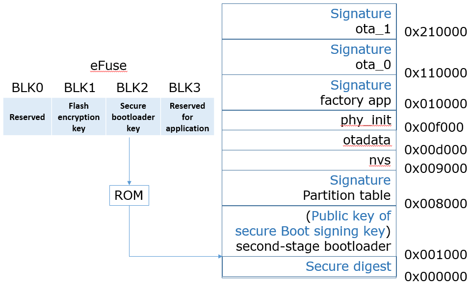

# ESP32 Secure Boot

This project demonstrates how to enable secure boot (Reflashable Mode) on the ESP32. We will show the procedure for enabling secure boot for the current application, and we will verify that secure boot is enabled. Finally, we will show how the user can upload a new firmware as long as they have the correct signing key, and we will show how the user can update the bootloader due to the Reflashable Mode setting.

Our device uses [Secure Boot V1](https://docs.espressif.com/projects/esp-idf/en/latest/esp32/security/secure-boot-v1.html) (version 1), and cannot use [Secure Boot V2](https://docs.espressif.com/projects/esp-idf/en/latest/esp32/security/secure-boot-v2.html).

**NOTE**
- The tutorial assumes that there is no flash encryption enabled on ESP32.
- Once secure boot is enabled, it is enabled forever and can NOT be disabled like the development mode of flash encryption. 

## Introduction to Secure Boot

Secure boot is a security mechanism supported by the ESP32 that verifies the integrity of the application (and the bootloader) at boot-time. It is important to understand how the secure boot procedure works, which is explained below:

1) After secure boot is *first* enabled, the ESP32 hardware uses a 256-bit **secure bootloader key** to generate a digest of the software bootloader's contents. This key is stored in an eFuse. The digest algorithm is effectively _SHA(AES<sub>k</sub>(B))_, where _SHA_ is the SHA-512 hash function, _AES_ is the AES-256 encryption function in ECB mode, _B_ is the bootloader contents, and _k_ is the secure bootloader key.
2) The digest is stored at offset 0x0 of the flash while the software bootloader is stored at address 0x1000.
3) The software bootloader uses the public key component of an ECDSA keypair (called the **secure boot signing key**) to verify the firmware image. This means all firmware images must be signed by the secure boot signing key.
4) If the signature is verified, then the software bootloader loads the firmware image and runs the application.
5) If the ESP32 is *reset*, the ROM bootloader verifies the integrity of the software bootloader by re-calculating the digest and comparing it to the stored digest. The ROM bootloader will load the software bootloader only if the digests match. The software bootloader follows the procedure in Step 3 to verify and boot the firmware.



The ESP32 supports two kinds of secure boot modes: One-time Flash, and Reflashable:

* In **One-time Flash Mode**, the secure bootloader key is generated internally by the chip and stored in the eFuse, where it cannot be accessed by software. Since the key is inaccessible to the user, the software bootloader cannot be changed after secure boot is enabled.
* In **Reflashable Mode**, the build system generates the secure bootloader key using the SHA-256 digest of the secure boot signing key. This secure bootloader key is then stored in the eFuse. Assuming the user can access the secure boot signing key, the secure bootloader key can always be re-generated, and the software bootloader can be changed after secure boot is enabled.

We are going to enable secure boot in Reflashable Mode. 

## 0. Prerequisite: Install the ESP-IDF extension 
Our new Ubuntu VM is intalled with the ESP-IDF extension, which is our working environment. If you do not want to install it yourself, please download it at the specified website.

Otherwise, please follow [this tutorial](https://github.com/espressif/vscode-esp-idf-extension/blob/master/docs/tutorial/install.md) to install it within VS Code.

## 1. Download this project
Download this repository into your VM:

```
cd ~/Documents
git clone https://github.com/PBearson/ESP32_Secure_Boot_Tutorial.git
```

## 2. Configure the app

Load the project into VS Code via *File* -> *Open Folder ...*

Within VS Code, open a *Terminal* from its menu.

Within the terminal, use the following command to set up the environment variables
```
. $HOME/esp/esp-idf/export.sh
```

### WiFi

Open a terminal, and navigate to the root directory of this project. Open the project configuration menu:

```
idf.py menuconfig
```

Using the up/down arrow keys, navigate to the `Example Configuration` menu, press _enter_ to enter into the menu, then press _enter_ to begin typing your WiFi SSID. When you are done, do the same for the WiFi Password.

### Secure boot

Press _ESC_ and navigate to the `Security Features` menu, and press _enter_ to go into the menu. Select the option `Enable hardware Secure Boot in bootloader`. The secure bootloader mode will be set to One-time flash. We need to change it to Reflashable mode. Select the option `Secure bootloder mode (One-time flash)` and change it to `Reflashable`.

### Partition table
Press _ESC_ again and change to the `Partition Table` menu. We need to change the offset of the partition table because the bootloader (which is stored in flash _before_ the partition table) will grow in size. Change the offset of the partition table from 0x8000 to 0x10000.

After you are done, press _ESC_ again until you are prompted to save. Press _Y_ to save and exit.

## 3. Generate secure boot signing key
Before we build the application, first we need to generate the secure boot signing key by running this command:
```
espsecure.py generate_signing_key secure_boot_signing_key.pem
```

**CAUTION: The secure boot signing key is needed every time you want to upload a new firmware. Make sure not to lose it.**

## 4. Build bootloader

Now build the bootloader:

```
idf.py bootloader
```
The build system will 
- append the public key component of the signing key to the software bootloader, and 
- calculate the secure bootloader key. 

      
## 5. Burn secure bootloader key into eFuse

The secure bootloader key is stored in the following path: _build/bootloader/secure-bootloader-key-256.bin_. Now we need to burn this key into the BLOCK2 eFuse:

```
espefuse.py burn_key secure_boot_v1 build/bootloader/secure-bootloader-key-256.bin
```
Follow the instructions and type `BURN` to finish setting the eFuse.

**NOTE: If using the Hiletgo ESP-WROOM-32 development board, you may need to hold down the IO0 button on the ESP32 when the build system tries to connect to the ESP32's serial port. If you do not hold down the IO0 button during this step, the build system may fail to detect the serial port.**

## 6. Upload the bootloader
Now upload the bootloader to the ESP32:

```
esptool.py write_flash 0x1000 build/bootloader/bootloader.bin
```
Note: 
- When secure boot is enabled, the bootloader is not uploaded automatically when we run "idf.py build flash monitor". We have to upload it manually using the "write_flash" command.
- The first time the device runs with secure boot enabled, the device will generate the digest for us. So we do not have to supply the digest this first time.

## 7. Flash app and others
Finally, build and flash the rest of the application:

```
idf.py build flash monitor
```

You should see the bootloader and application proceed as normal. In fact, if you closely inspect the bootloader output, you will see that secure boot has been enabled.

### idf.py build output
<pre>
iot@iot-VirtualBox:~/Documents/ESP32_Secure_Boot_Tutorial$ idf.py build flash monitor
Executing action: all (aliases: build)
Running ninja in directory /home/iot/Documents/ESP32_Secure_Boot_Tutorial/build
Executing "ninja all"...
[2/965] Performing build step for 'bootloader'
[1/1] cd /home/iot/Documents/ESP32_Secure_Boot_Tutorial/build/bootloader/esp-idf/esptool_py && /home/iot/.espressif/python_env/idf4.4_py3.8_env/bin/python /home/iot/esp/esp-idf/components/partition_table/check_sizes.py --offset 0x10000 bootloader 0x1000 /home/iot/Documents/ESP32_Secure_Boot_Tutorial/build/bootloader/bootloader.bin
Bootloader binary size 0x92e0 bytes. 0x5d20 bytes (39%) free.
[514/963] <b>Generating ../../signature_verification_key.bin</b>
espsecure.py v3.2-dev
/home/iot/Documents/ESP32_Secure_Boot_Tutorial/secure_boot_signing_key.pem public key extracted to /home/iot/Documents/ESP32_Secure_Boot_Tutorial/build/signature_verification_key.bin
[961/963] Generating binary image from built executable
esptool.py v3.2-dev
Merged 25 ELF sections
Generated /home/iot/Documents/ESP32_Secure_Boot_Tutorial/build/wifi_station-unsigned.bin
[962/963] <b>Generating signed binary image</b>
espsecure.py v3.2-dev
Signed 655280 bytes of data from /home/iot/Documents/ESP32_Secure_Boot_Tutorial/build/wifi_station-unsigned.bin with key /home/iot/Documents/ESP32_Secure_Boot_Tutorial/secure_boot_signing_key.pem
Generated signed binary image /home/iot/Documents/ESP32_Secure_Boot_Tutorial/build/wifi_station.bin from /home/iot/Documents/ESP32_Secure_Boot_Tutorial/build/wifi_station-unsigned.bin
[963/963] cd /home/iot/Documents/ESP32_Secure_Boot_Tutorial/build/esp-idf/esptool_py &&...rtition-table.bin /home/iot/Documents/ESP32_Secure_Boot_Tutorial/build/wifi_station.bin
wifi_station.bin binary size 0x9fff4 bytes. Smallest app partition is 0x100000 bytes. 0x6000c bytes (38%) free.
Executing action: flash
Serial port /dev/ttyUSB0
Connecting...
Detecting chip type... Unsupported detection protocol, switching and trying again...
Connecting...
Detecting chip type... ESP32
Running ninja in directory /home/iot/Documents/ESP32_Secure_Boot_Tutorial/build
Executing "ninja flash"...
[1/5] cd /home/iot/Documents/ESP32_Secure_Boot_Tutorial/build/esp-idf/esptool_py && /ho...rtition-table.bin /home/iot/Documents/ESP32_Secure_Boot_Tutorial/build/wifi_station.bin
wifi_station.bin binary size 0x9fff4 bytes. Smallest app partition is 0x100000 bytes. 0x6000c bytes (38%) free.
[2/5] Performing build step for 'bootloader'
[1/1] cd /home/iot/Documents/ESP32_Secure_Boot_Tutorial/build/bootloader/esp-idf/esptool_py && /home/iot/.espressif/python_env/idf4.4_py3.8_env/bin/python /home/iot/esp/esp-idf/components/partition_table/check_sizes.py --offset 0x10000 bootloader 0x1000 /home/iot/Documents/ESP32_Secure_Boot_Tutorial/build/bootloader/bootloader.bin
Bootloader binary size 0x92e0 bytes. 0x5d20 bytes (39%) free.
[2/3] cd /home/iot/esp/esp-idf/components/esptool_py && /home/iot/.espressif/tools/cmak...ot_Tutorial/build" -P /home/iot/esp/esp-idf/components/esptool_py/run_serial_tool.cmake
esptool.py esp32 -p /dev/ttyUSB0 -b 460800 --before=default_reset --after=no_reset write_flash --flash_mode dio --flash_freq 40m --flash_size 2MB 0x20000 wifi_station.bin 0x10000 partition_table/partition-table.bin
</pre>

### First boot output
<pre>
rst:0x1 (POWERON_RESET),boot:0x13 (SPI_FAST_FLASH_BOOT)
configsip: 0, SPIWP:0xee
clk_drv:0x00,q_drv:0x00,d_drv:0x00,cs0_drv:0x00,hd_drv:0x00,wp_drv:0x00
mode:DIO, clock div:2
load:0x3fff0038,len:10076
ho 0 tail 12 room 4
load:0x40078000,len:23640
ho 0 tail 12 room 4
load:0x40080400,len:3792
0x40080400: _init at ??:?

entry 0x40080694
I (31) boot: ESP-IDF v4.4-dirty 2nd stage bootloader
I (31) boot: compile time 08:58:55
I (31) boot: chip revision: 1
I (34) boot_comm: chip revision: 1, min. bootloader chip revision: 0
I (41) boot.esp32: SPI Speed      : 40MHz
I (45) boot.esp32: SPI Mode       : DIO
I (50) boot.esp32: SPI Flash Size : 2MB
I (55) boot: Enabling RNG early entropy source...
I (60) boot: Partition Table:
I (64) boot: ## Label            Usage          Type ST Offset   Length
I (71) boot:  0 nvs              WiFi data        01 02 00011000 00006000
I (78) boot:  1 phy_init         RF data          01 01 00017000 00001000
I (86) boot:  2 factory          factory app      00 00 00020000 00100000
I (93) boot: End of partition table
I (97) boot_comm: chip revision: 1, min. application chip revision: 0
I (105) esp_image: segment 0: paddr=00020020 vaddr=3f400020 size=13e30h ( 81456) map
I (143) esp_image: segment 1: paddr=00033e58 vaddr=3ffb0000 size=03834h ( 14388) load
I (149) esp_image: segment 2: paddr=00037694 vaddr=40080000 size=08984h ( 35204) load
I (163) esp_image: segment 3: paddr=00040020 vaddr=400d0020 size=6e1a0h (450976) map
I (327) esp_image: segment 4: paddr=000ae1c8 vaddr=40088984 size=0b960h ( 47456) load
I (346) esp_image: segment 5: paddr=000b9b30 vaddr=50000000 size=00010h (    16) load
I (347) esp_image: segment 6: paddr=000b9b48 vaddr=00000000 size=06438h ( 25656) 
I (361) <b>esp_image: Verifying image signature...</b>
I (707) boot: Loaded app from partition at offset 0x20000
I (707) boot_comm: chip revision: 1, min. application chip revision: 0
I (709) esp_image: segment 0: paddr=00001020 vaddr=3fff0038 size=0275ch ( 10076) 
I (720) esp_image: segment 1: paddr=00003784 vaddr=40078000 size=05c58h ( 23640) 
I (731) esp_image: segment 2: paddr=000093e4 vaddr=40080400 size=00ed0h (  3792) 
W (735) <b>secure_boot_v1: Using pre-loaded secure boot key in EFUSE block 2</b>
I (741) <b>secure_boot_v1: Generating secure boot digest...</b>
I (791) secure_boot_v1: Digest generation complete.
I (791) boot: Checking secure boot...
I (791) efuse: Batch mode of writing fields is enabled
I (796) secure_boot_v1: blowing secure boot efuse...
I (801) secure_boot: Read & write protecting new key...
I (807) <b>secure_boot: Disable JTAG...</b>
I (812) secure_boot: Disable ROM BASIC interpreter fallback...
I (829) efuse: Batch mode. Prepared fields are committed
I (829) secure_boot_v1: secure boot is now enabled for bootloader image
I (834) boot: Disabling RNG early entropy source...
I (850) cpu_start: Pro cpu up.
I (851) cpu_start: Starting app cpu, entry point is 0x40081174
0x40081174: call_start_cpu1 at /home/iot/esp/esp-idf/components/esp_system/port/cpu_start.c:156

I (0) cpu_start: App cpu up.
I (865) cpu_start: Pro cpu start user code
I (865) cpu_start: cpu freq: 160000000
I (865) cpu_start: Application information:
I (869) cpu_start: Project name:     wifi_station
I (875) cpu_start: App version:      4bb7792
I (880) cpu_start: Compile time:     Apr 13 2022 09:09:24
I (886) cpu_start: ELF file SHA256:  1379ea420aef69e4...
I (892) cpu_start: ESP-IDF:          v4.4-dirty
I (897) heap_init: Initializing. RAM available for dynamic allocation:
I (904) heap_init: At 3FFAE6E0 len 00001920 (6 KiB): DRAM
I (910) heap_init: At 3FFB74E0 len 00028B20 (162 KiB): DRAM
I (916) heap_init: At 3FFE0440 len 00003AE0 (14 KiB): D/IRAM
I (923) heap_init: At 3FFE4350 len 0001BCB0 (111 KiB): D/IRAM
I (929) heap_init: At 400942E4 len 0000BD1C (47 KiB): IRAM
I (937) spi_flash: detected chip: generic
I (940) spi_flash: flash io: dio
W (944) spi_flash: Detected size(4096k) larger than the size in the binary image header(2048k). Using the size in the binary image header.
I (958) cpu_start: Starting scheduler on PRO CPU.
I (0) cpu_start: Starting scheduler on APP CPU.
I (1051) wifi station: ESP_WIFI_MODE_STA
I (1081) wifi:wifi driver task: 3ffc0060, prio:23, stack:6656, core=0
I (1081) system_api: Base MAC address is not set
I (1081) system_api: read default base MAC address from EFUSE
I (1091) wifi:wifi firmware version: 7679c42
I (1091) wifi:wifi certification version: v7.0
I (1091) wifi:config NVS flash: enabled
I (1091) wifi:config nano formating: disabled
I (1101) wifi:Init data frame dynamic rx buffer num: 32
I (1101) wifi:Init management frame dynamic rx buffer num: 32
I (1111) wifi:Init management short buffer num: 32
I (1111) wifi:Init dynamic tx buffer num: 32
I (1121) wifi:Init static rx buffer size: 1600
I (1121) wifi:Init static rx buffer num: 10
I (1131) wifi:Init dynamic rx buffer num: 32
I (1131) wifi_init: rx ba win: 6
I (1131) wifi_init: tcpip mbox: 32
I (1141) wifi_init: udp mbox: 6
I (1141) wifi_init: tcp mbox: 6
I (1141) wifi_init: tcp tx win: 5744
I (1151) wifi_init: tcp rx win: 5744
I (1151) wifi_init: tcp mss: 1440
I (1161) wifi_init: WiFi IRAM OP enabled
I (1161) wifi_init: WiFi RX IRAM OP enabled
I (1201) phy_init: phy_version 4670,719f9f6,Feb 18 2021,17:07:07
W (1201) phy_init: failed to load RF calibration data (0x1102), falling back to full calibration
I (1361) wifi:mode : sta (4c:11:ae:a4:54:b0)
I (1361) wifi:enable tsf
I (1361) wifi station: wifi_init_sta finished.
I (2031) wifi:new:<6,0>, old:<1,0>, ap:<255,255>, sta:<6,0>, prof:1
I (2951) wifi:state: init -> auth (b0)
I (2961) wifi:state: auth -> assoc (0)
I (2971) wifi:state: assoc -> run (10)
W (2981) wifi:<ba-add>idx:0 (ifx:0, 00:7f:28:d9:41:4a), tid:7, ssn:0, winSize:64
I (2991) wifi:connected with CWS5Q, aid = 21, channel 6, BW20, bssid = 00:7f:28:d9:41:4a
I (2991) wifi:security: WPA2-PSK, phy: bgn, rssi: -75
I (3001) wifi:pm start, type: 1

I (3051) wifi:AP's beacon interval = 102400 us, DTIM period = 1
W (4381) wifi:<ba-add>idx:1 (ifx:0, 00:7f:28:d9:41:4a), tid:0, ssn:0, winSize:64
I (5061) esp_netif_handlers: sta ip: 192.168.1.19, mask: 255.255.255.0, gw: 192.168.1.1
I (5061) wifi station: got ip:192.168.1.19
I (5061) wifi station: connected to ap SSID:XXX password:XXXXXX
</pre>

### Later boot output
<pre>
rst:0x1 (POWERON_RESET),boot:0x13 (SPI_FAST_FLASH_BOOT)
configsip: 0, SPIWP:0xee
clk_drv:0x00,q_drv:0x00,d_drv:0x00,cs0_drv:0x00,hd_drv:0x00,wp_drv:0x00
mode:DIO, clock div:2
load:0x3fff0038,len:10076
ho 0 tail 12 room 4
load:0x40078000,len:23640
ho 0 tail 12 room 4
load:0x40080400,len:3792
0x40080400: _init at ??:?

entry 0x40080694
I (35) boot: ESP-IDF v4.4-dirty 2nd stage bootloader
I (35) boot: compile time 08:58:55
I (36) boot: chip revision: 1
I (39) boot_comm: chip revision: 1, min. bootloader chip revision: 0
I (46) boot.esp32: SPI Speed      : 40MHz
I (50) boot.esp32: SPI Mode       : DIO
I (55) boot.esp32: SPI Flash Size : 2MB
I (59) boot: Enabling RNG early entropy source...
I (65) boot: Partition Table:
I (68) boot: ## Label            Usage          Type ST Offset   Length
I (76) boot:  0 nvs              WiFi data        01 02 00011000 00006000
I (83) boot:  1 phy_init         RF data          01 01 00017000 00001000
I (91) boot:  2 factory          factory app      00 00 00020000 00100000
I (98) boot: End of partition table
I (102) boot_comm: chip revision: 1, min. application chip revision: 0
I (109) esp_image: segment 0: paddr=00020020 vaddr=3f400020 size=13e30h ( 81456) map
I (148) esp_image: segment 1: paddr=00033e58 vaddr=3ffb0000 size=03834h ( 14388) load
I (153) esp_image: segment 2: paddr=00037694 vaddr=40080000 size=08984h ( 35204) load
I (168) esp_image: segment 3: paddr=00040020 vaddr=400d0020 size=6e1a0h (450976) map
I (332) esp_image: segment 4: paddr=000ae1c8 vaddr=40088984 size=0b960h ( 47456) load
I (351) esp_image: segment 5: paddr=000b9b30 vaddr=50000000 size=00010h (    16) load
I (352) esp_image: segment 6: paddr=000b9b48 vaddr=00000000 size=06438h ( 25656) 
I (366) <b>esp_image: Verifying image signature...</b>
I (712) boot: Loaded app from partition at offset 0x20000
I (712) secure_boot_v1: bootloader secure boot is already enabled. No need to generate digest. continuing..
I (717) boot: Checking secure boot...
I (722) secure_boot_v1: bootloader secure boot is already enabled, continuing..
I (730) boot: Disabling RNG early entropy source...
I (746) cpu_start: Pro cpu up.
I (747) cpu_start: Starting app cpu, entry point is 0x40081174
0x40081174: call_start_cpu1 at /home/iot/esp/esp-idf/components/esp_system/port/cpu_start.c:156

I (0) cpu_start: App cpu up.
I (761) cpu_start: Pro cpu start user code
I (761) cpu_start: cpu freq: 160000000
I (761) cpu_start: Application information:
I (765) cpu_start: Project name:     wifi_station
I (771) cpu_start: App version:      4bb7792
I (776) cpu_start: Compile time:     Apr 13 2022 09:09:24
I (782) cpu_start: ELF file SHA256:  1379ea420aef69e4...
I (788) cpu_start: ESP-IDF:          v4.4-dirty
I (793) heap_init: Initializing. RAM available for dynamic allocation:
I (800) heap_init: At 3FFAE6E0 len 00001920 (6 KiB): DRAM
I (806) heap_init: At 3FFB74E0 len 00028B20 (162 KiB): DRAM
I (812) heap_init: At 3FFE0440 len 00003AE0 (14 KiB): D/IRAM
I (819) heap_init: At 3FFE4350 len 0001BCB0 (111 KiB): D/IRAM
I (825) heap_init: At 400942E4 len 0000BD1C (47 KiB): IRAM
I (833) spi_flash: detected chip: generic
I (836) spi_flash: flash io: dio
W (840) spi_flash: Detected size(4096k) larger than the size in the binary image header(2048k). Using the size in the binary image header.
I (854) cpu_start: Starting scheduler on PRO CPU.
I (0) cpu_start: Starting scheduler on APP CPU.
I (906) wifi station: ESP_WIFI_MODE_STA
I (926) wifi:wifi driver task: 3ffc0578, prio:23, stack:6656, core=0
I (926) system_api: Base MAC address is not set
I (926) system_api: read default base MAC address from EFUSE
I (946) wifi:wifi firmware version: 7679c42
I (946) wifi:wifi certification version: v7.0
I (946) wifi:config NVS flash: enabled
I (946) wifi:config nano formating: disabled
I (946) wifi:Init data frame dynamic rx buffer num: 32
I (956) wifi:Init management frame dynamic rx buffer num: 32
I (956) wifi:Init management short buffer num: 32
I (966) wifi:Init dynamic tx buffer num: 32
I (966) wifi:Init static rx buffer size: 1600
I (966) wifi:Init static rx buffer num: 10
I (976) wifi:Init dynamic rx buffer num: 32
I (976) wifi_init: rx ba win: 6
I (986) wifi_init: tcpip mbox: 32
I (986) wifi_init: udp mbox: 6
I (986) wifi_init: tcp mbox: 6
I (996) wifi_init: tcp tx win: 5744
I (996) wifi_init: tcp rx win: 5744
I (1006) wifi_init: tcp mss: 1440
I (1006) wifi_init: WiFi IRAM OP enabled
I (1006) wifi_init: WiFi RX IRAM OP enabled
I (1016) phy_init: phy_version 4670,719f9f6,Feb 18 2021,17:07:07
W (1176) phy_init: saving new calibration data because of checksum failure, mode(0)
I (1246) wifi:mode : sta (4c:11:ae:a4:54:b0)
I (1246) wifi:enable tsf
I (1246) wifi station: wifi_init_sta finished.
I (1316) wifi:new:<6,0>, old:<1,0>, ap:<255,255>, sta:<6,0>, prof:1
I (1316) wifi:state: init -> auth (b0)
I (1326) wifi:state: auth -> assoc (0)
I (1326) wifi:state: assoc -> run (10)
W (1326) wifi:<ba-add>idx:0 (ifx:0, 00:7f:28:d9:41:4a), tid:7, ssn:0, winSize:64
I (1336) wifi:connected with CWS5Q, aid = 21, channel 6, BW20, bssid = 00:7f:28:d9:41:4a
I (1336) wifi:security: WPA2-PSK, phy: bgn, rssi: -80
I (1346) wifi:pm start, type: 1

I (1416) wifi:AP's beacon interval = 102400 us, DTIM period = 1
W (4406) wifi:<ba-add>idx:1 (ifx:0, 00:7f:28:d9:41:4a), tid:0, ssn:0, winSize:64
I (7406) esp_netif_handlers: sta ip: 192.168.1.19, mask: 255.255.255.0, gw: 192.168.1.1
I (7406) wifi station: got ip:192.168.1.19
I (7406) wifi station: connected to ap SSID:XXX password:XXXXXX
</pre>

## Verify Secure Boot is Working

Now we will prove that secure boot is working as intended. We are going to modify the application and show that the secure boot mechanism prevents the modified application from running. 

### 8. Change application code
Open the application code (_main/station_example_main.c_) in an editor such as VSCode. Change the code in any way you like. In my case, I have changed the TAG variable from "wifi station" to "wifi station BRYAN":


Save your changes and open the configuration menu:

```
idf.py menuconfig
```

Navigate to `Security Features` and disable the option `Enable hardware Secure Boot in bootloader`. This will temporarily disable secure boot. After disabling the option, leave the configuration menu and save the changes.

Now build the application:

```
idf.py build
```

Since we disabled secure boot, the bootloader has also been modified, and it will automatically be uploaded using the typical command (`idf.py flash`). For now, we will only upload the modified application, but not the bootloader. To upload the application only, we need to know what address the application is uploaded to the flash (this address is affected by the partition table offset, which we modified earlier). Luckily, the output from the build command tells us which address the application will be flashed to, as shown in the following screenshot:


Assuming your flash address is also 0x20000, you can use the following command to upload the application to the ESP32:

```
esptool.py write_flash 0x20000 build/wifi_station.bin
```

Now open the serial monitor:

```
idf.py monitor
```

You should see that the ROM bootloader successfully loads the software bootloader, but the software bootloader fails to load the application because it cannot verify the application's signature:


### Upload bootloader

Now upload the bootloader image, and observe how the ROM bootloader now fails to load the software bootloader:

```
esptool.py write_flash 0x1000 build/bootloader/bootloader.bin
```

You should see output similar to the following:


## Update the Application After Secure Boot is Enabled

Now we will see how the user can update the application and bootloader. Keep in mind that the bootloader can only be updated in Reflashable Mode.

Open the configuration menu again, and re-enable the option `Enable hardware Secure Boot in bootloader`. Make sure to also set the option `Secure bootloader mode` to `Reflashable`. Leave and save your changes.

Now build the bootloader:

```
idf.py bootloader
```

The bootloader is prefixed with the SHA-512 digest that the ROM uses to verify the bootloader. The build system can generate this digest since we supply the secure boot signing key (which is used to derive the secure bootloader key). Recall that the digest should be stored at offset 0x0 in the flash. Therefore, we now need to upload the bootloader, which is prefixed with the bootloader digest, to address 0x0.

```
esptool.py write_flash 0x0 build/bootloader/bootloader-reflash-digest.bin
```
The write_flash command is writing both the bootloader and the bootloader digest to the flash (they are part of the same binary).

Finally, build and upload the rest of the application as normal:

```
idf.py build flash monitor
```

You should see the bootloader and application load successfully, and the application should contain the changes we made: 


## Enable Flash Encryption After Secure Boot Is Enabled

If flash encryption has never been enabled on your ESP32, then follow [this procedure](https://github.com/PBearson/ESP32_Flash_Encryption_Tutorial#enable-flash-encryption) to enable it. Since the partition table offset has already been set to 0x10000, there is no need to modify it further. Since secure boot is enabled, make sure to build and flash the bootloader separately, as described above.

## Notes

### A Note about Flash Encryption

If you have previously enabled flash encryption (Development Mode) on this ESP32, then you can still follow this tutorial without making too many changes. The only differences are the following:

* Replace `idf.py flash` with `idf.py encrypted-flash`
* Any command starting with `esptool.py write_flash` must contain the `--encrypt` argument; for example: `esptool.py write_flash --encrypt 0x1000 build/bootloader/bootloader.bin`
